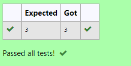

# RANK-OF-A-MATRIX
## Aim:
To write a python program to find the rank of a matrix
## Equipment’s required:
1. 	Hardware – PCs
2. 	Anaconda – Python 3.7 Installation / Moodle-Code Runner
## Algorithm:
### Step 1: 
Importing the numpy library
### Step 2: 
Assigning the matrix in arrays
### Step 3:
Using the np.linalg.matrix_rank(), we can find the rank of the given matrix.
### Step 4:
Print the Output 
## Program:
```
#Program to find the rank of a matrix.
#Developed by: Udayakumar R
#RegisterNumber: 22008609
import numpy as np
A=np.array([[5,-3,10],[2,2,-3],[-3,-1,5]])
sol=np.linalg.matrix_rank(A)
print(sol)
```

## Output:

## Result:
Thus the rank for the given matrix is successfully solved by  using a python program.

